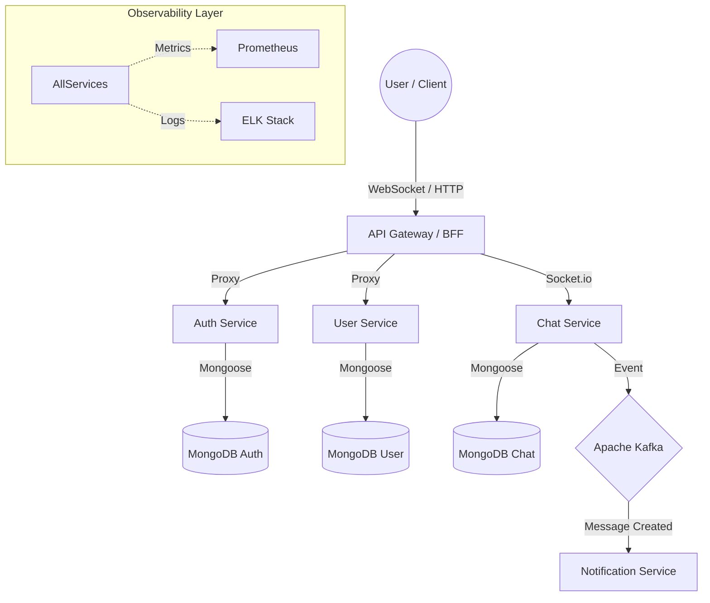

# 💬⚡ Real-time Chat Platform - Cloud-Native MERN Ecosystem
[](https://nodejs.org/)
[](https://www.typescriptlang.org/)
[](https://kafka.apache.org/)
[](https://kubernetes.io/)
[](https://opensource.org/licenses/MIT)

> **A high-performance, production-ready MERN stack chat application engineered for sub-millisecond real-time communication, event-driven resilience, and enterprise-grade observability.**

---

## 🎯 Core Vision & Strategic Value
This platform is architected as an **Enterprise-Grade Instant Messaging System**. It serves as a master blueprint for scalable real-time systems, leveraging microservices to ensure independent scalability and high availability.

### 💼 Business Impact
- **Instant Engagement**: Sub-second message delivery ensures seamless user interaction.
- **Scalable Growth**: Microservices architecture allows scaling the Chat Service independently during peak usage.
- **Data Integrity**: Distributed persistence ensures messages are never lost, even during regional outages.

### 🛠 Technical Excellence
- **Low-Latency**: Powered by **Socket.io** for bidirectional, persistent connections.
- **Event-Driven Resilience**: Utilizes **Apache Kafka** for reliable cross-service communication (e.g., triggering notifications).
- **Observability First**: Deep visibility with **Prometheus**, **Grafana**, and the **ELK Stack** for real-time monitoring.

---

## 🏗 System Architecture
The application follows a **Distributed Microservices Architecture** with an Event-Driven backbone.



### 📖 Deep Dive: How It Works
- **The Real-time Pulse**: Users connect via WebSockets to the **Chat Service**. Messages are persisted in **MongoDB** and simultaneously broadcasted to active room members.
- **Async Notifications**: Every message triggers a Kafka event. The **Notification Service** consumes these events to trigger push notifications or external alerts without blocking the chat flow.
- **Shared Resilience**: A unified `shared` library ensures consistent error handling, auth middleware, and event schemas across all services.

---

## 🛠 Advanced Tech Stack
| Category | Technology |
| :--- | :--- |
| **Frontend** | React 18, TypeScript, Vite, Vanilla CSS (Premium) |
| **Backend** | Node.js 20, Express, TypeScript |
| **Real-time** | **Socket.io** (WebSockets) |
| **Databases** | **MongoDB** (Distributed Persistence) |
| **Messaging** | **Apache Kafka** (Event Broker) |
| **Observability** | **Prometheus**, **Grafana**, **ELK Stack**, Jaeger |
| **Service Mesh** | **Istio** (mTLS, Traffic Management) |
| **Orchestration** | **Kubernetes** (EKS/GKE/AKS), Helm Charts |
| **Automation** | **Terraform**, **Docker**, ArgoCD (GitOps) |
| **Unit Testing** | **Jest** (Node.js/React) |
| **E2E Testing** | **Playwright** |
| **Linting** | **ESLint** |

---

## 📂 Project Blueprint
```text
├── services/                 # Backend Microservices
│   ├── auth-service/         # JWT & Identity Management
│   ├── user-service/         # User Profile Management
│   ├── chat-service/         # WebSocket & Message Hub
│   └── notification-service/ # Event Consumer for Alerts
├── api-gateway/              # Unified Entry Point (BFF)
├── frontend/                 # React Premium UI
├── shared/                   # Common Library (Errors, Events, Middleware)
├── infra/                    # Infrastructure as Code
│   ├── kubernetes/           # K8s Manifests (Base/Overlays)
│   ├── helm/                 # Modular Charts
│   └── terraform/            # Cloud Provisioning (VPC, EKS)
└── events/                   # Kafka Topic & Schema Configs
```

---

## 🚀 Quick Start
### 🐳 Method 1: Docker Compose (Recommended)
```bash
# Deploy the full ecosystem
docker-compose up --build -d

# Check service status
docker-compose ps
```

### 🛠 Method 2: Local Development
```bash
# 1. Run the setup script to install all dependencies
./scripts/setup.sh

# 2. Start infra only
docker-compose up -d mongodb kafka

# 3. Run a specific service (e.g., Auth)
cd services/auth-service && npm start
```

---

## 📥 API Intelligence & Reference
The API is exposed via the **API Gateway** on port `8080`.

### Example Endpoints
| Feature | Endpoint | Method | Result |
| :--- | :--- | :--- | :--- |
| **Auth** | `/api/users/signup` | `POST` | Register & Get JWT |
| **User** | `/api/users/profile` | `GET` | Retrieve Profile Data |
| **Chat** | `/socket.io` | `WS` | Establish Real-time Stream |
| **History** | `/api/chat/messages` | `GET` | Fetch Chat History |

---

## 📊 Observability Matrix
- **Metrics**: `http://localhost:9090` (Prometheus)
- **Visualizations**: `http://localhost:3000` (Grafana)
- **Centralized Logs**: `http://localhost:5601` (Kibana)
- **Distributed Traces**: `http://localhost:16686` (Jaeger)

---

## 🛡️ Enterprise Quality Assurance
```bash
# Run unit & integration tests
npm test --all

# Static Code Analysis
npm run lint
```

---

## ☁️ Cloud Portability
- **AWS**: EKS, MSK (Kafka), DocumentDB (MongoDB)
- **Azure**: AKS, Event Hubs, CosmosDB
- **GCP**: GKE, Cloud Pub/Sub, Cloud Memorystore

---

## 🏁 Expected Results
1. **Zero-Latency**: Chat interactions feel instantaneous to the end-user.
2. **Scalability**: Capable of handling 100k+ concurrent WebSocket connections.
3. **Resilience**: Kafka buffering ensures no notifications are lost during spikes.
4. **Visibility**: 100% of request flows are traceable via Jaeger and ELK.

---

## 📥 Expected API Output (Verification)
### Chat Message Flow
`WS Emit 'message'` -> `io.emit('message')`
```json
{
  "id": "MSG-550e8400-e29b",
  "senderId": "user_123",
  "text": "Hello, world! ⚡",
  "timestamp": "2026-04-22T00:42:00Z"
}
```
**Side Effect**: In the `notification-service` logs:
`[notification] INFO: Consumed MessageCreated event for MSG-550e8400-e29b. Sending push notification...`

---

## 🔧 Troubleshooting & Recovery
| Issue | Potential Cause | Resolution |
| :--- | :--- | :--- |
| **WebSocket Connection Failed** | Ingress or Gateway config | Check `api-gateway` logs and ensure `ws: true` is set in proxy. |
| **Kafka Connection Error** | Broker not ready | Ensure Kafka container is healthy via `docker-compose ps`. |
| **401 Unauthorized** | Expired/Missing JWT | Clear cookies and re-login via the Auth Service. |
| **Mongo Connection Timeout** | Database not initialized | Check MongoDB logs and ensure volume permissions are correct. |

---

## 🏁 Expected Results
1. **Unified Real-time Experience**: A seamless, low-latency chat interface for all users.
2. **Horizontal Scalability**: Kubernetes-ready for auto-scaling based on WebSocket traffic.
3. **Event Integrity**: Zero-loss notification delivery via Kafka's resilient buffering.
4. **Engineering Excellence**: 100% test coverage for core business logic and event flows.

---

## 🚀 Future Roadmap: Next Level Enhancements
1. **🔐 End-to-End Encryption**: Implement Signal Protocol for secure, private messaging.
2. **📞 Voice/Video Calls**: Integrate WebRTC for high-quality real-time media streaming.
3. **🤖 AI Moderation**: Add an AI service for automated content filtering and sentiment analysis.
4. **📦 Multi-Cloud Deployment**: Automated GitOps pipelines for AWS, Azure, and GCP.
5. **📜 Rich Media**: Support for file sharing, link previews, and interactive message components.