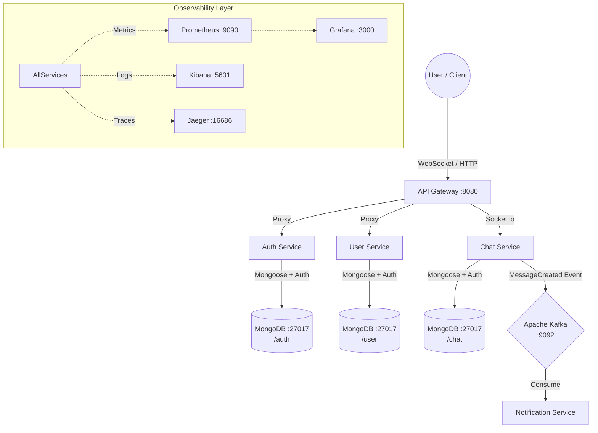

# 💬⚡ Real-time Chat Platform — Cloud-Native MERN Ecosystem

[](https://nodejs.org/)
[](https://www.typescriptlang.org/)
[](https://kafka.apache.org/)
[](https://www.mongodb.com/)
[](https://kubernetes.io/)
[](https://www.docker.com/)
[](https://opensource.org/licenses/MIT)

> **A high-performance, production-ready MERN stack chat platform engineered for sub-millisecond real-time communication, event-driven resilience, and enterprise-grade observability.**

---

## 🎯 Core Vision & Strategic Value

This platform is architected as an **Enterprise-Grade Instant Messaging System** — a master blueprint for scalable real-time systems, leveraging microservices to ensure independent scalability and high availability.

### 💼 Business Impact

- **Instant Engagement**: Sub-second message delivery ensures seamless user interaction.
- **Scalable Growth**: Microservices architecture allows scaling the Chat Service independently during peak usage.
- **Data Integrity**: Distributed persistence ensures messages are never lost, even during regional outages.

### 🛠 Technical Excellence

- **Low-Latency**: Powered by **Socket.io** for bidirectional, persistent WebSocket connections.
- **Event-Driven Resilience**: Utilizes **Apache Kafka** (KRaft mode, no ZooKeeper) for reliable cross-service communication.
- **Observability First**: Deep visibility with **Prometheus**, **Grafana**, **ELK Stack**, and **Jaeger** tracing.
- **Secure by Default**: MongoDB authentication enforced via `MONGO_INITDB_ROOT_USERNAME/PASSWORD`; JWT secrets externalized to `.env`.

---

## 🏗 System Architecture


```mermaid
graph TD
    User((User / Client)) -->|WebSocket / HTTP| Gateway[API Gateway :8080]
    Gateway -->|Proxy| AuthSvc[Auth Service]
    Gateway -->|Proxy| UserSvc[User Service]
    Gateway -->|Socket.io| ChatSvc[Chat Service]

    AuthSvc -->|Mongoose + Auth| AuthDB[(MongoDB :27017\n/auth)]
    UserSvc -->|Mongoose + Auth| UserDB[(MongoDB :27017\n/user)]
    ChatSvc -->|Mongoose + Auth| ChatDB[(MongoDB :27017\n/chat)]

    ChatSvc -->|MessageCreated Event| Kafka{Apache Kafka\n:9092}
    Kafka -->|Consume| NotificationSvc[Notification Service]

    subgraph "Observability Layer"
        AllServices -..->|Metrics| Prometheus[Prometheus :9090]
        AllServices -..->|Logs| ELK[Kibana :5601]
        AllServices -..->|Traces| Jaeger[Jaeger :16686]
        Prometheus -..-> Grafana[Grafana :3000]
    end
```

### 📖 How It Works

- **Real-time Pulse**: Users connect via WebSockets to the **Chat Service**. Messages are persisted in MongoDB and simultaneously broadcast to active room members.
- **Async Notifications**: Every message triggers a Kafka event. The **Notification Service** consumes these events and handles push notifications without blocking the chat flow.
- **Shared Resilience**: A unified `shared/` library provides consistent error handling, auth middleware, and Kafka event schemas across all services.

---

## 🛠 Tech Stack

| Category             | Technology                               |
| :------------------- | :--------------------------------------- |
| **Frontend**         | React 18, TypeScript, Vite               |
| **Backend**          | Node.js 20, Express, TypeScript          |
| **Real-time**        | Socket.io (WebSockets)                   |
| **Database**         | MongoDB (auth-guarded, per-service DBs)  |
| **Messaging**        | Apache Kafka (KRaft mode — no ZooKeeper) |
| **Observability**    | Prometheus, Grafana, ELK Stack, Jaeger   |
| **Service Mesh**     | Istio (mTLS, Traffic Management)         |
| **Orchestration**    | Kubernetes (EKS/GKE/AKS), Helm Charts    |
| **GitOps**           | ArgoCD                                   |
| **IaC**              | Terraform                                |
| **Containerization** | Docker, Docker Compose                   |
| **Testing**          | Jest (unit), Playwright (E2E)            |
| **Linting**          | ESLint                                   |

---

## 📂 Repository Structure

```text
mern-realtime-chat/
├── services/
│   ├── auth-service/         # JWT & Identity Management
│   ├── user-service/         # User Profile Management
│   ├── chat-service/         # WebSocket Hub & Message Persistence
│   └── notification-service/ # Kafka Consumer for Push Alerts
├── api-gateway/              # Unified Entry Point (BFF)
├── frontend/                 # React Premium UI
├── shared/                   # Common Library (Errors, Events, Middleware)
├── events/                   # Kafka Topic & Schema Configs
├── infra/
│   ├── docker/               # Per-service Dockerfiles
│   ├── kubernetes/
│   │   ├── base/             # Base K8s Manifests
│   │   ├── overlays/         # Environment Overlays (Kustomize)
│   │   └── namespaces/       # Namespace Definitions
│   ├── helm/                 # Modular Helm Charts
│   ├── terraform/            # Cloud Provisioning (VPC, EKS)
│   ├── istio/                # Service Mesh Config
│   ├── argocd/               # GitOps Application Manifests
│   └── observability/
│       ├── prometheus/
│       ├── grafana/
│       ├── elk/
│       └── tracing/
├── scripts/
│   └── setup.sh              # Dependency bootstrap script
├── docker-compose.yml        # Full local stack
└── .env                      # Local secrets (not committed)
```

---

## 🚀 Quick Start

### Prerequisites

- [Docker Desktop](https://www.docker.com/products/docker-desktop/) ≥ 24
- [Node.js](https://nodejs.org/) ≥ 20 (for local dev only)

### ⚙️ Step 1 — Configure Environment

Copy the example env file and update credentials before starting:

```bash
# The .env file is auto-loaded by Docker Compose
cp .env .env.local   # optional backup
```

Default `.env` values:

```env
MONGO_USERNAME=admin
MONGO_PASSWORD=changeme
JWT_KEY=changeme_jwt_secret
```

> ⚠️ **Change these values** before deploying to any non-local environment. `.env` is already in `.gitignore`.

### 🐳 Step 2 — Start with Docker Compose (Recommended)

```bash
# Start the full ecosystem (builds all services)
docker compose up -d --build

# Verify all containers are healthy
docker compose ps

# Tail logs from all services
docker compose logs -f

# Tear down
docker compose down
```

**Expected running containers after `up`:**

| Container      | Port    | Role                               |
| :------------- | :------ | :--------------------------------- |
| `mongodb`      | `27017` | Primary datastore (auth-protected) |
| `kafka`        | `9092`  | Event broker (KRaft mode)          |
| `auth-service` | —       | JWT auth (internal)                |
| `user-service` | —       | User profiles (internal)           |
| `chat-service` | —       | WebSocket & messaging (internal)   |
| `api-gateway`  | `8080`  | Public entry point                 |

### 🛠 Step 3 — Local Development (Per-Service)

```bash
# 1. Bootstrap all service dependencies
./scripts/setup.sh

# 2. Start only the infrastructure (DB + Kafka)
docker compose up -d mongodb kafka

# 3. Run a specific service locally
cd services/auth-service && npm start
```

---

## 📡 API Reference

All endpoints are exposed via the **API Gateway** on `http://localhost:8080/`.

| Feature       | Method | Endpoint             | Description                               |
| :------------ | :----- | :------------------- | :---------------------------------------- |
| **Register**  | `POST` | `/api/users/signup`  | Register a new user & receive JWT         |
| **Login**     | `POST` | `/api/users/signin`  | Authenticate & receive JWT                |
| **Profile**   | `GET`  | `/api/users/profile` | Retrieve the authenticated user's profile |
| **Messages**  | `GET`  | `/api/chat/messages` | Fetch paginated chat history              |
| **WebSocket** | `WS`   | `/socket.io`         | Establish real-time bidirectional stream  |

### Example WebSocket Message Payload

```json
{
  "id": "MSG-550e8400-e29b",
  "senderId": "user_123",
  "text": "Hello, world! ⚡",
  "timestamp": "2026-05-09T10:00:00Z"
}
```

---

## 📊 Observability Stack

| Tool           | URL                      | Purpose                     |
| :------------- | :----------------------- | :-------------------------- |
| **Prometheus** | `http://localhost:9090`  | Metrics scraping & alerting |
| **Grafana**    | `http://localhost:3000`  | Dashboards & visualization  |
| **Kibana**     | `http://localhost:5601`  | Centralized log search      |
| **Jaeger**     | `http://localhost:16686` | Distributed request tracing |

---

## 🛡️ Quality Assurance

```bash
# Run all unit & integration tests
npm test --workspaces

# Static code analysis
npm run lint --workspaces

# Type checking
npm run typecheck --workspaces
```

---

## ☁️ Cloud Deployment Targets

| Cloud     | Kubernetes | Kafka         | MongoDB         |
| :-------- | :--------- | :------------ | :-------------- |
| **AWS**   | EKS        | MSK           | DocumentDB      |
| **Azure** | AKS        | Event Hubs    | Cosmos DB       |
| **GCP**   | GKE        | Cloud Pub/Sub | Atlas (managed) |

GitOps delivery is managed via **ArgoCD** with manifests in `infra/argocd/`.

---

## 🔧 Troubleshooting

| Symptom                          | Likely Cause                  | Resolution                                                                                                               |
| :------------------------------- | :---------------------------- | :----------------------------------------------------------------------------------------------------------------------- |
| `bitnami/kafka:latest not found` | Image removed from Docker Hub | ✅ Fixed — now uses `apache/kafka:latest`                                                                                |
| **WebSocket Connection Failed**  | Gateway misconfiguration      | Check `api-gateway` logs; ensure `ws: true` in proxy config                                                              |
| **Kafka Connection Error**       | Broker not ready              | Wait for `kafka` container to be healthy: `docker compose ps`                                                            |
| **401 Unauthorized**             | Expired or missing JWT        | Clear cookies and re-authenticate via `/api/users/signin`                                                                |
| **MongoDB Auth Failed**          | Credentials mismatch          | Ensure `.env` values match what's in `docker-compose.yml`; restart with `docker compose down -v && docker compose up -d` |
| **Service fails to start**       | MongoDB not yet healthy       | Services use `condition: service_healthy` — MongoDB healthcheck must pass first                                          |

---

## 🚀 Roadmap

| Priority        | Feature                      | Description                                                     |
| :-------------- | :--------------------------- | :-------------------------------------------------------------- |
| 🔥 High         | **🔐 End-to-End Encryption** | Implement Signal Protocol for private messaging                 |
| 🔥 High         | **📞 Voice/Video Calls**     | WebRTC integration for real-time media streaming                |
| 🟡 Medium       | **🤖 AI Moderation**         | Automated content filtering and sentiment analysis              |
| 🟡 Medium       | **📦 Multi-Cloud GitOps**    | ArgoCD pipelines targeting AWS, Azure, and GCP simultaneously   |
| 🟢 Nice-to-have | **📜 Rich Media**            | File sharing, link previews, and interactive message components |
| 🟢 Nice-to-have | **🌐 Internationalization**  | Multi-language support via i18n                                 |

---

## 📄 License

This project is licensed under the [MIT License](https://opensource.org/licenses/MIT).
